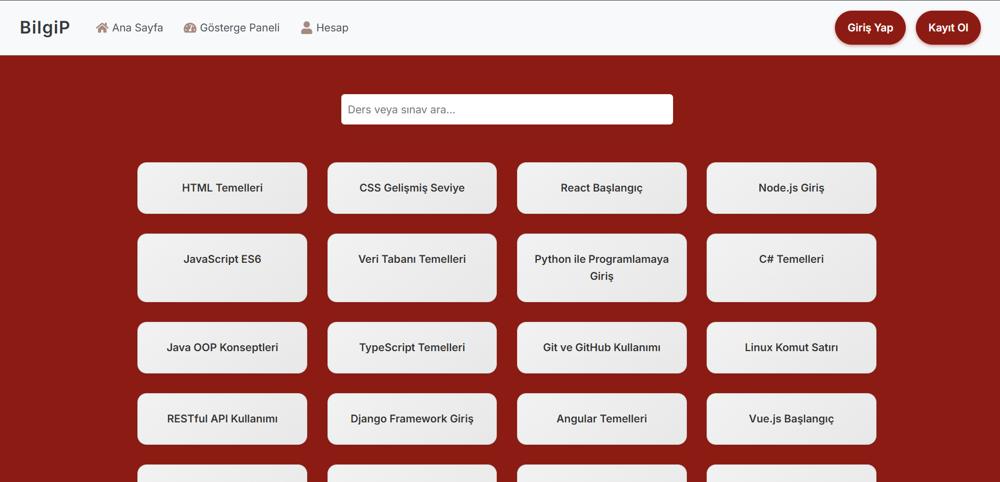
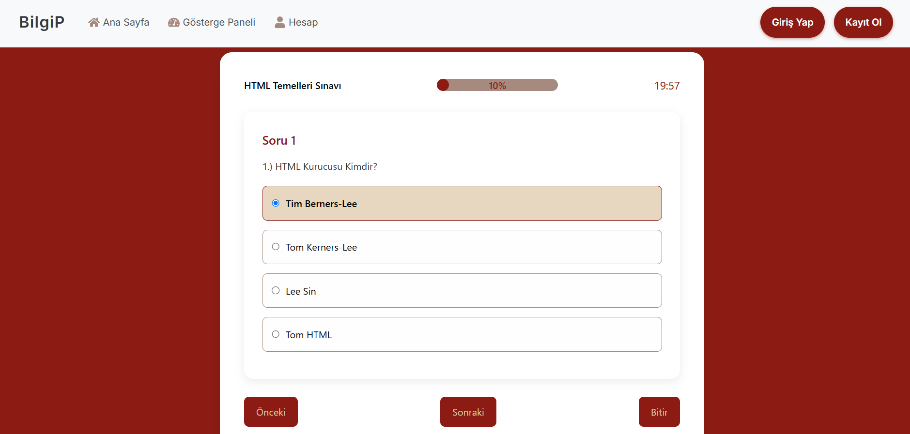
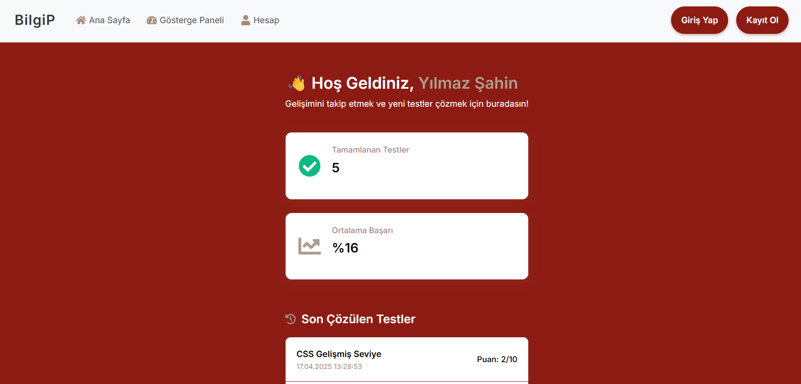

# 🧠 bilgiP

React ile geliştirilen, kullanıcı dostu ve etkileşimli bir quiz uygulaması. 🚀  
bilgiP; farklı kategorilerde testler sunar, zamanlayıcıyla heyecanı artırır ve sınav sonrası detaylı analizlerle öğrenmeyi destekler.

---

### 🎯 Özellikler

### 📋 Test Modülü
-  **20 farklı test** seçeneği
-  **Zaman sınırlı** test çözme deneyimi
-  **İlerleme yüzdesi** takibi
-  **Doğru / ❌ Yanlış** sayısı gösterimi
-  Test bitiminde **performans özeti**

### 📈 Gösterge Paneli
-  Son girilen sınav zamanı
-  Doğru sayısı
-  % Başarı oranı
- Test önerileri

### 👤 Kullanıcı Profili
-  Profil bilgilerini **düzenleme** seçeneği

### 🔐 Giriş & Kayıt
-  **Giriş Yap** ve **Kayıt Ol** sayfaları
-  Kolay yönlendirme ile sorunsuz kullanıcı deneyimi

### 🛠️ Kullanılan Teknolojiler

-  React
-  React Router
-  Custom Timer Hooks
-  CSS / Styled Components 

### 📸 Uygulamadan Görseller

